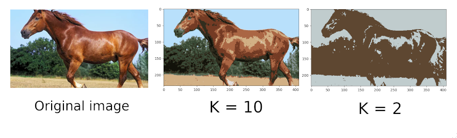
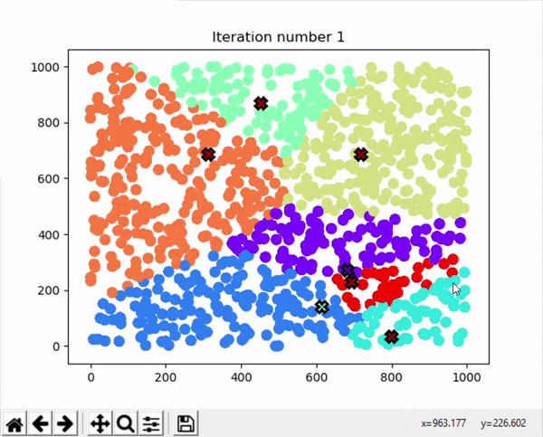

### __K-MEANS algorithm project__

#### Overview
2D points k-means algorithm visualization. <br>
Image colors quantization algorithm implementation. <br>

#### Requirements
 - python 3
 - python-tk
 - pip

#### Image processing demo
K - number of centroids <br>
<br>


#### Points visualization demo
K - number of centroids <br>
K = 7 <br>
<br>


#### Set up
Create new virtualenv:
```
virtualenv -p python3 venv
```
Activate environment
on Linux:
```
source venv/bin/activate
```
On Windows:
```
venv\Scripts\activate.bat
```
Install required packages:
```
pip install -r requirements.txt
```

#### Run
First set variables in src/k_means/settings.py

To run image processing algorithm in project directory run:
```
python src/k_means/main.py IMAGE
```
In IMAGE mode, algorithm runs colors quantization. <br>
Firstly unique random colors are selected as initial centroids. <br>
<br>
To run points visualization algorithm in project directory run:
```
python src/k_means/main.py POINTS
```
In POINTS mode file with random points is generated in data directory, <br>
than algorithm starts running using this data. <br>
For 2D points, when algorithm is finished visualization is being run.
